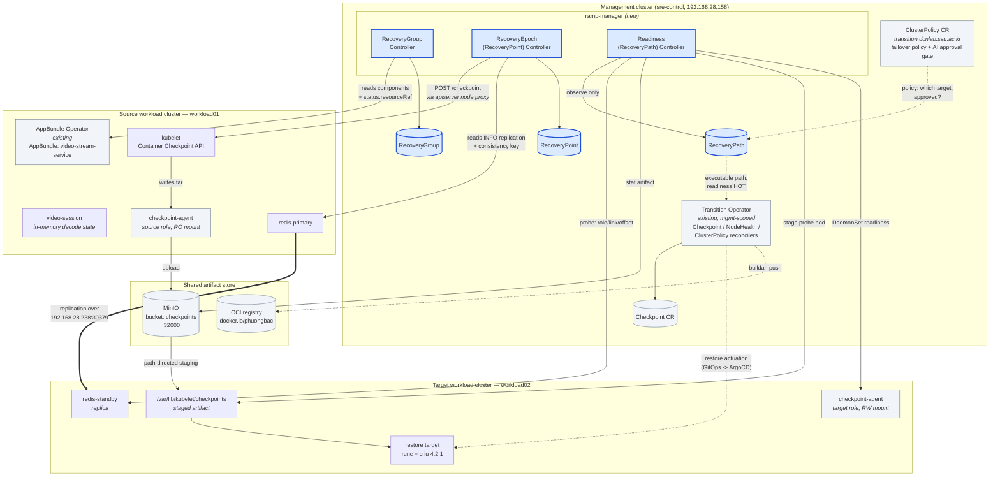

# 01 — Integration Design

This design is constrained by what the audit found, not by what the RAMP
concept would prefer. Every deviation from the brief's suggested shape is
justified from evidence in
[`00-existing-system-audit.md`](00-existing-system-audit.md).

---

## 1. Architecture



Blue = added by this work. Grey = pre-existing and reused unchanged.

---

## 2. Responsibility table

| Component | Runs where | Existing / New | Input | Output | Responsibility |
|---|---|---|---|---|---|
| **AppBundle Operator** | workload01 | Existing (installed by this work) | `AppBundle` CR | deployed resources, `status…resourceRef`, `app.example.com/*` labels | Application structure, deployment ordering, Porch realisation |
| **RecoveryGroup Controller** | mgmt (reads workload01) | **New** | `RecoveryGroup`, AppBundle status | member resolution, driver binding, `latestRecoveryPoint` | Owns the recovery-consistency domain |
| **RecoveryEpoch Controller** | mgmt | **New** | `RecoveryPoint` spec, source cluster state | committed `RecoveryPoint` with heterogeneous artifacts | PREPARE→BARRIER→CAPTURE→VALIDATE→COMMIT |
| **Readiness Controller** | mgmt (reads both clusters) | **New** | `RecoveryPath`, target state, artifact store | `status.readiness` HOT/WARM/COLD + per-check reasons | Decide whether a path is executable |
| **Transition Operator** | mgmt | Existing (unmodified) | `ClusterPolicy`, `Checkpoint` | checkpoint artifacts, GitOps restore, ArgoCD sync | Execute transition / checkpoint / restore |
| **checkpoint-agent (source role)** | workload01 nodes | Existing (unmodified manifest) | kubelet checkpoint tars | MinIO objects, `NodeHealth` heartbeats | Node-local artifact upload |
| **checkpoint-agent (target role)** | workload02 nodes | Existing binary, **new overlay** | MinIO objects | staged artifacts on node | Restore capability + staging |
| **MinIO / OCI registry** | mgmt | Existing | artifacts | artifacts | Shared artifact store |

---

## 3. Boundary questions answered explicitly

### ClusterPolicy vs RecoveryPath

`ClusterPolicy` already selects a target: `helpers.DetermineTargetRepo()` picks
the highest-weighted entry from `spec.targetClusterPolicy.preferClusters`. What
it cannot say is whether that target is **prepared**. It has no notion of a
recovery point, an artifact, or a synchronised standby, so an approved failover
can be dispatched at a target that will take five minutes to become usable.

* **ClusterPolicy stays** the policy and authorisation layer: which clusters are
  permissible, what the operator/agent approved (`status.phase: Approved`), what
  fault triggered it.
* **RecoveryPath adds** the executability layer: given that policy, is there a
  committed recovery point, is the artifact staged, is the standby caught up,
  does the target have room. It answers *can we*, not *should we*.

The intended composition is `ClusterPolicy` (should) → `RecoveryPath` (can) →
`Transition Operator` (do). Scenario 1 implements the middle term and leaves the
adapter as an extension point — see §7.

### RecoveryGroup Controller vs Readiness Controller

They fail for different reasons and must be debuggable apart.

* RecoveryGroup Controller looks **inward at the application**: are the members
  resolvable through the AppBundle, is each driver bound and usable on the
  source. Its failure mode is "the application is not in a shape that can be
  captured".
* Readiness Controller looks **outward at the target**: is the artifact there,
  is the standby caught up, is there capacity. Its failure mode is "the
  destination is not ready to receive".

Collapsing them would make `status` unable to distinguish "we cannot produce a
recovery point" from "we have one but nowhere to use it" — which are the two
things an operator most needs to tell apart.

### Readiness Controller vs Transition Operator

The Readiness Controller is **strictly observational**. It runs no checkpoint,
promotes no replica, restores no container, and writes to no `ClusterPolicy`.
Its only side effect on a workload cluster is a short-lived, read-only staging
probe Pod, which exists because the management plane cannot otherwise see a
node's filesystem. Everything that changes the world is the Transition
Operator's (§7 notes what Scenario 1 does by script instead).

### Transition Operator vs Checkpoint Agent

Already settled by the existing code and left alone: the operator is the
cluster-scoped orchestrator (decides *that* a checkpoint happens, drives the
kubelet API, promotes the artifact to an OCI image, drives the GitOps restore);
the agent is the node-local artifact handler (uploads what the kubelet wrote,
stages what a target will need, heartbeats `NodeHealth`).

### AppBundle vs RecoveryGroup

The Scenario-1 objects make the distinction concrete:

| | AppBundle `video-stream-service` | RecoveryGroup `video-stream-rg` |
|---|---|---|
| `data/redis` | ✅ component | ✅ member, driver `redis-replication` |
| `data/redis-service` | ✅ component | ❌ — a RecoveryPath prerequisite |
| `streaming/video` | ✅ component | ✅ member, driver `container-checkpoint` |
| `streaming/video-service` | ✅ component | ❌ — a RecoveryPath prerequisite |

Four deployment components, two recovery members. The Services are
reconstructed, not recovered; recovering them "independently" cannot violate
correctness, so they are outside the consistency domain. The deployment
dependency (`data → streaming`, strict) is also **not** the recovery dependency:
at recovery time Redis and video are recovered by different mechanisms that must
agree on a position, which is a mutual constraint, not an ordering.

---

## 4. Where the controllers run, and why not where the brief suggested

The brief suggests keeping RecoveryGroup reconciliation workload-local. The
audit disproved that as the cheaper option here:

1. **The actuation API is mgmt-only.** The `Checkpoint` CRD and the Transition
   Operator exist only on the management cluster. A workload-local RecoveryGroup
   controller would have to write `Checkpoint` CRs *back* to mgmt — a
   cross-cluster write with its own credential and failure surface. Running on
   mgmt removes that edge entirely.
2. **Readiness is inherently multi-cluster.** The RecoveryPath controller must
   read source and target simultaneously. Placing RecoveryPoint elsewhere would
   split the epoch from its consumer for no benefit.
3. **The precedent already exists.** `ClusterPolicyReconciler.GetWorkloadClusterClientByName()`
   shows the Transition Operator already reaching into workload clusters from
   mgmt via CAPI kubeconfigs. RAMP uses the same shape (`--cluster name=path`).

So all three RAMP CRDs live on mgmt and all three reconcilers run in one
manager process there — but as **three separate reconcilers**, never a
monolith, each with its own status surface. The controller is
*workload-aware*: every input to the RecoveryGroup reconciler comes from the
workload cluster (AppBundle, Deployments, Pods, Redis).

**Extension point.** Nothing in the API assumes co-location. `RecoveryGroup`
already carries `spec.appBundleRef.cluster`, so moving the group/epoch
reconcilers into the workload cluster later is a deployment change, not an API
change, once `Checkpoint` is federated.

---

## 5. Transport adaptation: how RAMP invokes the checkpoint

The Transition Operator dials `https://<NodeInternalIP>:10250`. Audit §1.1/§3.3
showed that cannot work here — `10.6.0.0/24` is unroutable from mgmt, and the
Node objects carry **no** `ExternalIP` to fall back to. There are also two
defects in that code path (variable shadowing; wrong address family).

RAMP reaches the **same kubelet endpoint** through the workload apiserver's node
proxy:

```
POST {apiserver}/api/v1/nodes/{node}/proxy/checkpoint/{ns}/{pod}/{container}
```

Measured: **1.3–1.9 s** per checkpoint, 10 MB artifact. Same API, same on-node
tar, same checkpoint-agent → MinIO pipeline afterwards. This is a transport
change, not a second checkpoint implementation, and it is isolated in
`internal/drivers/containercheckpoint.go` so that when the Transition Operator
gains a working transport, RAMP can delegate instead.

> One implementation trap worth recording: `rest.Config.Timeout` is serialised
> by client-go as a `?timeout=` query parameter, and the kubelet checkpoint
> handler rejects it with `cannot parse value of timeout parameter`. The bound
> must come from the request context instead.

### Why the Transition Operator was not patched

A fix is small but not free: preferring `NodeExternalIP` does not help (there
isn't one), so a correct fix must join the Node to its CAPI `Machine` on mgmt to
find the floating IP. That is a real behavioural change to a component that
other work depends on. It is recorded in audit §3.3 as a recommendation with
evidence, and left to its owners. RAMP's diff against every pre-existing
repository is **zero**.

---

## 6. The readiness state machine

Deterministic, no scoring, no prediction:

```
if every mandatory check is True                  -> HOT
else if RecoveryPointCommitted and TargetReachable -> WARM
else                                               -> COLD
```

Mandatory checks: `RecoveryPointCommitted`, `TargetClusterReachable`,
`TargetNamespaceReady`, `VideoCheckpointAvailable`, `VideoCheckpointStaged`,
`RedisStandbyReady`, `RestoreCapabilityAvailable`, `TargetResourceReady`.

Every check records `status`, `reason`, `message` and `lastProbeTime`, and
`status.unmetMandatoryChecks` names exactly what is missing, so
`kubectl get recoverypath <p> -o yaml` alone explains the level.

`estimatedRTO` is a **sum of remaining work**, not a prediction: HOT costs
promotion + restore; WARM adds the staging cost; COLD is the rebuild cost.

**`VideoCheckpointStaged` is the check that earns the HOT/WARM distinction.** An
artifact in MinIO is *available*; an artifact on a target node is *staged*. The
difference is a real transfer that would otherwise be paid at failure time, and
it is measured, not inferred — by a one-shot probe Pod that stats the file on
the target node, because the management plane cannot see node filesystems.

---

## 7. What Scenario 1 deliberately does not implement

* **No optimizer.** One manually specified path, deterministically evaluated.
* **No automatic RecoveryGroup inference.** AppBundle is the authoritative
  application graph; membership and driver binding are explicit.
* **No ClusterPolicy adapter yet.** `RecoveryPath` publishes readiness; nothing
  consumes it automatically. Wiring `canAutoTransition()` to require a HOT path
  is the smallest next integration and needs no RAMP API change.
* **Actuation is scripted, not operator-driven.** The Transition Operator's
  restore path is GitOps (rewrite image in Gitea → push to `dr` repo → ArgoCD
  sync on `<target>-dr`). Scenario 1's application has no Gitea package or
  ArgoCD Application, and building one was not required to demonstrate
  readiness. Recovery execution therefore lives in
  `scripts/ramp-scenario1/50-recover.sh`, which stands in for the Transition
  Operator. This is the largest gap between the design and the implementation
  and is stated as such.
* **Preparation is scripted, not controlled.** Staging a path (WARM→HOT) is
  `scripts/ramp-scenario1/30-prepare-path.sh`. It is not in the Readiness
  Controller on purpose — that controller must not act. Promoting it to a
  Preparation Controller is the natural R6 step.
