# 05 — The GitOps restore path, verified, and what it implies for a RecoveryDriver

## 1. What was verified

The Transition Operator's actuation chain, reproduced for the Scenario 1
workload and confirmed to restore process memory rather than restart the
process. Evidence: `evidence/scenario1/gitops-restore/`.

```mermaid
flowchart LR
    K["kubelet<br/>Container Checkpoint API"] --> T["tar on node"]
    T --> CA["checkpoint-agent"]
    CA --> M[("MinIO<br/>bucket checkpoints")]
    M --> IMG["OCI checkpoint image<br/>scratch + tar +<br/>org.criu.checkpoint.*"]
    IMG --> PKG["nephio/workload01.git<br/>path video-session/<br/><i>image rewritten</i>"]
    IMG -.->|"in production"| REG[("registry")]
    PKG --> DR["nephio/dr.git<br/>path workload02-dr/<br/><i>ArgoCD Application</i>"]
    DR --> AOA["ArgoCD workload02-dr<br/><i>app-of-apps, automated</i>"]
    AOA --> CHILD["ArgoCD<br/>argocd-workload01-video-session"]
    CHILD --> CD["containerd on workload02"]
    CD --> P["process RESTORED<br/>same session uuid"]

    classDef new fill:#dbeafe,stroke:#1d4ed8,stroke-width:2px
    class PKG,DR,CHILD new
```



> **Superseded numbers.** The per-stage figures in this section came from a run
> whose harness mis-measured the ArgoCD stage. The corrected three-variant
> measurement, to *application* readiness rather than pod readiness, is in
> [06-application-health-and-timing.md](06-application-health-and-timing.md):
> **7.8 s** with an explicit sync trigger and a prepared path, **291 s** without
> the trigger.

**9 seconds** from git push to a running, restored workload:

| | | Δ |
|---|---|---|
| `T_gitops_start` | 04:32:38 | |
| `T_git_pushed` | 04:32:41 | 3 s — 3 files via the Gitea API |
| `T_argocd_synced` | 04:32:46 | 5 s — app-of-apps created and synced the child |
| `T_workload_ready` | 04:32:47 | 1 s — rollout |

Proof it is a restore: the restored pod carries the **same in-memory
`session` UUID** as the still-running source process
(`319f64cb-fca9-42cf-8f56-ef074dc42104`) and resumed from the checkpoint
position 165, not the source's current 59388. containerd's own runtime
annotations say `restored = true`. The Deployment carries
`app.kubernetes.io/instance: argocd-workload01-video-session`, so ArgoCD created
it from git.

Script: `scripts/ramp-scenario1/60-gitops-restore.sh`.

## 2. Why this is the right shape for a RecoveryDriver

Recovery actuation here is **declarative and idempotent**: the recovery action
is "write the desired post-recovery state into git", and the convergence is
someone else's problem. That gives properties an imperative driver would have to
build by hand:

* **The recovery is auditable.** A git commit per recovery, with the image
  rewrite visible in the diff. The RecoveryPoint that was used is recoverable
  from history.
* **The recovery is idempotent and self-healing.** `selfHeal: true` means the
  restored workload stays restored. A half-applied recovery converges instead of
  leaving debris.
* **Rollback is a revert.** No inverse-action logic in the driver.
* **The driver needs no cluster credentials for the target.** It writes to git;
  ArgoCD on the target pulls. That matters a lot in this testbed, where the
  management plane can reach workload apiservers but the trust direction for
  actuation is better the other way round.
* **It already exists and already works.** Zero new actuation infrastructure.

## 3. Proposed `RecoveryDriver` interface

The two Scenario 1 drivers currently only *capture*. The verified GitOps path
gives the missing half, and both drivers fit one shape:

```go
// A RecoveryDriver knows how to capture one member's recovery state and how to
// re-establish it on a target. It never decides WHETHER to recover -- that is
// the RecoveryPath's readiness and the ClusterPolicy's approval.
type RecoveryDriver interface {
    Name() string

    // Capture produces this member's artifact for an epoch.
    Capture(ctx context.Context, m Member, epoch int64) (Artifact, error)

    // Prepare makes the artifact usable on the target WITHOUT activating it.
    // This is what moves a RecoveryPath from WARM to HOT, and what makes
    // readiness an elastic resource rather than a fixed periodic cost.
    Prepare(ctx context.Context, m Member, a Artifact, t Target) error

    // Activate performs the recovery on the target.
    Activate(ctx context.Context, m Member, a Artifact, t Target) error
}
```

| | `container-checkpoint` | `redis-replication` |
|---|---|---|
| `Capture` | kubelet Container Checkpoint API → tar → MinIO | `INFO replication` offset + application logical position |
| `Prepare` | build the OCI checkpoint image, push it, stage it on the target | nothing — the standby is already replicating (*this asymmetry is the point*) |
| `Activate` | rewrite the image in the package repo, push the DR Application, let ArgoCD converge | `REPLICAOF NO ONE` |

Note how unevenly the cost falls. For the checkpoint driver, `Prepare` is
expensive and is exactly what buys HOT readiness. For the replication driver,
`Prepare` is free because the mechanism is continuous. A RecoveryGroup mixing
them has a readiness profile neither member would have alone — which is the
research property Scenario 1 set out to demonstrate, now expressed as an
interface.

## 4. Two things that must be fixed before this becomes a driver

**4.1 `rootfsImageRef` normalisation is mandatory, not cosmetic.**
containerd's restore path *pulls* `config.dump.rootfsImageRef` from a registry;
it does not consult the local image store. The kubelet writes into that field
whichever identifier the node happened to hold, and on this testbed the same
Deployment produced both forms hours apart:

| recorded | what it is | pullable |
|---|---|---|
| `docker.io/library/python@sha256:2c941e86…` | registry index digest | ✅ |
| `sha256:9e87977b…` | node-local image ID | ❌ |

With the second form, restore is impossible however perfect the artifact is.
`config/ramp/restore/build-checkpoint-image.py` rewrites the field to a
registry-resolvable reference; without that, this driver is a coin flip. The
existing `default/video` app works only because `tuongvx/vlc-app` happened to be
recorded in the good form.

**4.2 Image promotion has no owner yet.**
Turning a committed RecoveryPoint's tar into an OCI checkpoint image is done
today by a script run on the target node. It belongs in the Transition Operator,
which already does exactly this with buildah — RAMP should only *request* it.
That keeps the boundary from `01-integration-design.md` intact: RAMP decides a
path is executable; the Transition Operator executes.

## 5. Where this sits in the responsibility split

Nothing about the split changes; the actuation box just becomes concrete:

```
RecoveryGroup Controller   membership, driver binding
RecoveryEpoch Controller   Capture() across drivers, validate, commit
Readiness Controller       observe Prepare() state -> HOT/WARM/COLD
Transition Operator        image promotion + Activate() via git
ArgoCD / containerd        convergence + the actual restore
```

The Readiness Controller still never acts: it *observes* whether `Prepare` has
happened (artifact staged, standby synchronised) and publishes readiness. What
is new is that `Prepare` and `Activate` now have a verified implementation to
point at.

## 6. What this run did NOT prove

The checkpoint image was imported straight into the target node's containerd
rather than pushed to a registry, so the manifest used `imagePullPolicy: Never`
and a `nodeSelector` pin. The registry-pull link is proven separately by the
pre-existing `default/video` app, which restores from
`docker.io/phuongbac/checkpoint-default_video-…` on both clusters — but not by
this run, for this workload. Closing that gap needs one `buildah push`
equivalent and nothing else.
